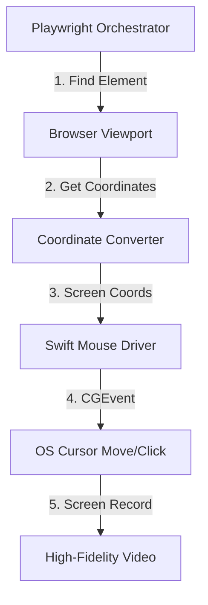

# 🛩️ ghost-pilot

**Playwright orchestration × real OS-level mouse events — web automation built for screen recording.**

`ghost-pilot` solves a unique problem: automating interactions on real websites while producing **human-like mouse movements** visible to screen recording software. Unlike pure browser automation (Playwright/Puppeteer) which uses synthetic events invisible to screen recorders, `ghost-pilot` moves the actual MacOS cursor using the native CGEvent API.

## ✨ Key Features

-   **Real Mouse Interaction**: Generates system-level mouse events (move, click, scroll) that are captured by screen recorders like Screen Studio, OBS, or QuickTime.
-   **Smooth Trajectories**: Uses a Swift-based driver to calculate and execute natural-looking mouse paths, avoiding the "robotic" linear movement of standard automation.
-   **Playwright Orchestration**: Leverages the power of Playwright for robust element selection, page navigation, and state waiting.
-   **Visual Feedback**: Optional injected UI badge showing real-time recording status, elapsed time, and mouse FPS.
-   **Coordinate Precision**: Automatically maps Playwright's viewport coordinates to MacOS screen coordinates, ensuring high-fidelity interaction regardless of window position.
-   **JSON Scenarios**: Easily define complex interaction flows in a simple, declarative JSON format.

## 🚀 How It Works



## 🛠️ Quick Start

### 1. Build the Mouse Driver
```bash
cd mouse-driver && swift build -c release
cp .build/release/ghost-mouse-driver ../ghost-mouse-driver-bin
cd ..
```

### 2. Install Dependencies
```bash
npm install
npx playwright install chromium
```

### 3. Run a Scenario
```bash
node bin/ghost-pilot.mjs run scenarios/antdv-button.json
```

## 📝 Scenario Format

```json
{
  "name": "My Demo",
  "url": "https://example.com",
  "viewport": { "width": 1440, "height": 900 },
  "waitForLoad": ".main-content",
  "steps": [
    { "action": "click", "selector": ".btn-primary", "label": "Click button" },
    { "action": "scroll", "delta": -3, "label": "Scroll down" },
    { "action": "type", "selector": "#search", "text": "hello", "label": "Type in search" },
    { "action": "hover", "selector": ".menu-item", "label": "Hover menu" },
    { "action": "wait", "ms": 1000, "label": "Pause" },
    { "action": "navigate", "url": "https://example.com/page2", "label": "Go to page 2" }
  ]
}
```

## 🎮 Supported Actions

| Action | Description |
|--------|-------------|
| `click` | Move to element smoothly and perform a real OS click |
| `hover` | Move to element smoothly without clicking |
| `scroll` | Natural wheel scroll by delta lines (negative = down) |
| `type` | Click an input field and type text with natural delays |
| `wait` | Pause for a specific duration (milliseconds) |
| `navigate` | Navigate to a new URL |

## ⚠️ Requirements

-   **macOS 12+** (uses `CoreGraphics` and `CGEvent` API)
-   **Swift 5.9+** (toolchain for building the driver)
-   **Node.js 18+**
-   **Accessibility Permissions**: The terminal running `ghost-pilot` must have Accessibility permissions.
    -   Go to **System Settings** → **Privacy & Security** → **Accessibility**.
    -   Add and enable your terminal (e.g., iTerm2, Terminal, or VS Code).

## 🩺 Troubleshooting

### Mouse coordinates are off
- Ensure the browser window is NOT in full-screen mode unless the scenario is configured for it.
- Check if your displays have "Displays have separate Spaces" enabled in Mission Control settings.
- The browser window should be focused before the clicks start.

### "Operation not permitted" error
- This is usually a MacOS permission issue. Make sure your terminal or IDE has Accessibility permissions (see Requirements).

## 📂 Project Structure

-   **`bin/ghost-pilot.mjs`**: CLI entry point and scenario runner.
-   **`src/orchestrator.mjs`**: Orchestrates Playwright for element detection and the Swift driver for mouse movements.
-   **`src/mouse.mjs`**: Bridge between Node.js and the Swift binary.
-   **`src/coordinate.mjs`**: Handles viewport-to-screen coordinate transformations.
-   **`src/recorder.mjs`**: High-frequency mouse trajectory capture and replay logic.
-   **`mouse-driver/`**: Native Swift code for low-level OS interaction.
